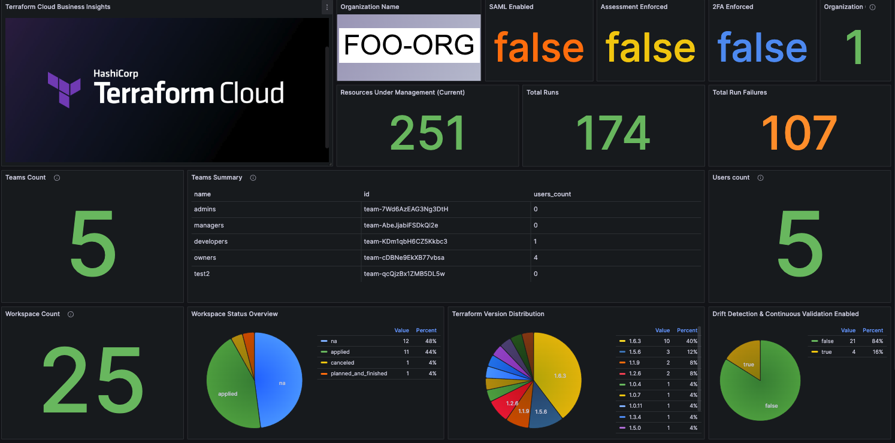

# 🔍 Terraform Business Insights (TFBI) 
> Business, Operational, and Adoption Insights for Terraform Cloud & Enterprise 

> Note: TFBI is a personal project and not associated with HashiCorp. 


**Summary:** Terraform Cloud Business Insights (TFBI) is a tool that provides business, operational, and adoption insights for Terraform Cloud/Enterprise operators. It implements both custom Prometheus collectors and metrics to query the Terraform Cloud/Enterprise API using [go-tfe](https://pkg.go.dev/github.com/hashicorp/go-tfe) Go libary and a Grafana dashboard to easily explore common business, operational, and adoption metrics. 




## Metrics

| API/Category | Metric Name | Type | Description | Implementation Status
| - | - | - | - | -| 
| Organization | Organization Summary | `Table` | Organization Details  |  ✅  | 
| Teams | Total # of Teams | `Gauge` | Current number of active teams in the organization  |  ✅  | 
| Teams | Teams Summary | `Table` | Team Summary Table  |  ✅  | 
| Projects | Projects Count | `Gauge` | Current number of active projects in the organization  |  ✅  | 
| Projects | Projects Summary | `Table` | Projects Summary  |  ✅  | 
| Projects | Projects Count Over Time | `Time Series Graph` | Time series graph showing of # number of active projects over time |  ✅  | 
| Users | Total # of Users | `Gauge` | Current number of active users in the organization  |  ✅  | 
| Workspaces | Workspace Count | `Gauge` | Current number of active workspaces in the organization  |  ✅  | 
| Workspaces | Workspaces Summary | `Table` | Workspaces Summary  |  ✅  | 
| Workspaces | Workspaces Status Overview | `Chart` | Workspaces status distribution chart |  ✅  | 
| Workspaces | Terraform Version Distribution | `Chart` | Terraform version distribution chart |  ✅  |
| Workspaces | Drift Detection & Continious Validation Enabled | `Chart` | Chart showing details on number / % of workspaces that enabled drift detection/continious validation |  ✅  |
| Workspaces | Workspaces Count Over Time | `Time Series Graph` | Time series graph showing of # number of active workspaces over time |  ✅  | 
| Workspaces | Workspaces Status History | `Time Series Graph` | Time series graph showing workspace status over time |  ✅  | 
| Runs | Total Runs | `Counter` | Total number of runs executed  |  ✅  | 
| Runs | Total Run Failures | `Counter` | Total number of failed runs  |  ✅  | 
| Resources  | Resources Under Management | `Gauge` | Number of Resources Under Management(RUM) |  ✅  |
| Policy Sets | Policy Set Count | `Gauge` | Current number of active policy sets organization  |  ✅  | 
| Policy Sets | Total Policy Check Failures | `Counter` | Total number of policy check failures  |  ✅  | 
| Policy Sets | Policy Set Summary | `Table` | Policy Sets Summary  |  ✅  | 
| Policy Sets  | Policy Type Distribution | `Chart` | Policy type distribution chart |  ✅  |
| Modules  | Modules Count | `Gauge` | Number of Modules in the Private Module Registry |  ✅  |
| Modules  | No-Code Module Distribution | `Chart` | Percentage of modules that are no-code ready |  ✅  |


> Note: go-tfe and the TFC/TFE API provide much more endpoints/data that can be scraped beyond what is implemented in TFBI. Feel free to provide feedback/contributions. 

## Usage

0. Clone this repo. 
1. Create a [Terraform Cloud or Enterprise API Token](https://app.terraform.io/app/settings/tokens)
2. Export your token and the name of your TFC Org:

```
export TF_API_TOKEN="TOKEN"
export TF_ORGANIZATIONS="ORG_NAME"
```

3. Spin up the application using Docker Compose

```

$ docker compose up -d

[+] Running 4/4
 ✔ Network tfbi_default         Created                                                           0.0s
 ✔ Container tfbi-grafana-1     Started                                                           0.0s
 ✔ Container tfbi-prometheus-1  Started                                                           0.1s
 ✔ Container tfbi-exporter-1    Started                                                           0.1s

```

4. Now you can access the dashboard using http://localhost:3000

> Note: It's recommended to create a Grafana user/password and login using it, otherwise you'll continue receiving auth warning logs in Grafan.

## Credits

Shoutout to [Kaisen Dorks](https://github.com/kaizendorks) for developing [terraform-cloud-exporter](https://github.com/kaizendorks/terraform-cloud-exporter) which I leveraged as the basis for developing TFBI. Much of the scaffloding/structure I leveraged in TFBI is based on their work, and for that I'd like to thank them.

## Reporting Issues 

Please raise any issues and submit any contribution by pushing a PR to this repo. 