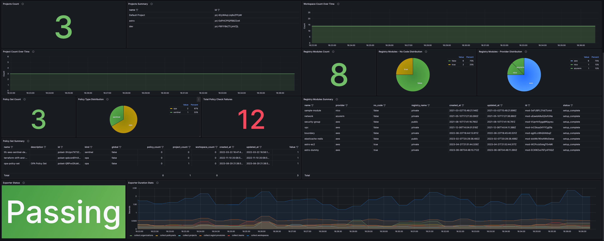

# Terraform Business Insights (TFBI) 
> Business, Operational, and Adoption Insights for Terraform Cloud & Enterprise 

## Overview

Terraform Cloud Business Insights (TFBI) is a tool that provides business, operational, and adoption insights for Terraform Cloud operators. It implements both custom Prometheus collectors and metrics to query the Terraform Cloud API using [go-tfe](https://pkg.go.dev/github.com/hashicorp/go-tfe) Go libary and a Grafana dashboard to easily explore common business, operational, and adoption metrics. 




## Metrics

Summary of metrics collected:

- Organization
- Projects
- Workspaces
- Runs
- Policies


## Usage

1. Create a [Terraform Cloud API Token](https://app.terraform.io/app/settings/tokens)
2. Export your token and the name of your TFC Org:

```
export TF_API_TOKEN="TOKEN"
export TF_ORGANIZATIONS="ORG_NAME"
```

3. Spin up the application using Docker Compose

```
docker compose up -d
[+] Running 3/0
 ✔ Container tfbi-exporter-1    Running                                                                                                                                                                                                                                       0.0s 
 ✔ Container tfbi-prometheus-1  Running                                                                                                                                                                                                                                       0.0s 
 ✔ Container tfbi-grafana-1     Running                  
```


