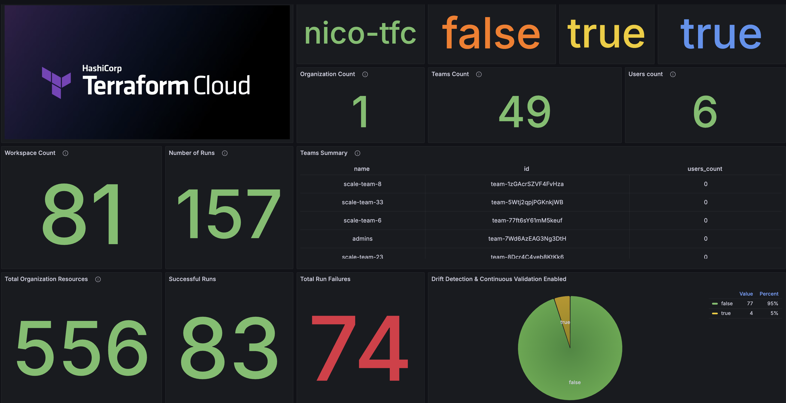
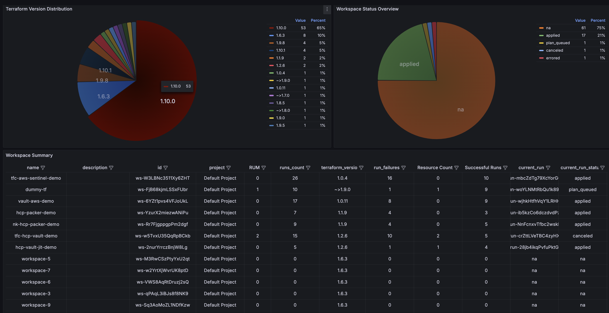

# 🔍 Terraform Business Insights (TFBI) 
> Business, Operational, and Adoption Insights for Terraform Cloud & Enterprise 

> Note: TFBI is a personal project and not associated with HashiCorp. 


**Summary:** Terraform Cloud Business Insights (TFBI) is a tool that provides business, operational, and adoption insights for Terraform Cloud/Enterprise operators. It implements both custom Prometheus collectors and metrics to query the Terraform Cloud/Enterprise API using [go-tfe](https://pkg.go.dev/github.com/hashicorp/go-tfe) Go libary and a Grafana dashboard to easily explore common business, operational, and adoption metrics. 





## Metrics

| API/Category | Metric Name | Type | Description | Implementation Status
| - | - | - | - | -| 
| Organization | Organization Summary | `Table` | Organization Details  |  ✅  | 
| Teams | Total # of Teams | `Gauge` | Current number of active teams in the organization  |  ✅  | 
| Teams | Teams Summary | `Table` | Team Summary Table  |  ✅  | 
| Projects | Projects Count | `Gauge` | Current number of active projects in the organization  |  ✅  | 
| Projects | Projects Summary | `Table` | Projects Summary  |  ✅  | 
| Projects | Projects Count Over Time | `Time Series Graph` | Time series graph showing of # number of active projects over time |  ✅  | 
| Users | Total # of Users | `Gauge` | Current number of active users in the organization  |  ✅  | 
| Workspaces | Workspace Count | `Gauge` | Current number of active workspaces in the organization  |  ✅  | 
| Workspaces | Workspaces Summary | `Table` | Workspaces Summary  |  ✅  | 
| Workspaces | Workspaces Status Overview | `Chart` | Workspaces status distribution chart |  ✅  | 
| Workspaces | Terraform Version Distribution | `Chart` | Terraform version distribution chart |  ✅  |
| Workspaces | Drift Detection & Continious Validation Enabled | `Chart` | Chart showing details on number / % of workspaces that enabled drift detection/continious validation |  ✅  |
| Workspaces | Workspaces Count Over Time | `Time Series Graph` | Time series graph showing of # number of active workspaces over time |  ✅  | 
| Workspaces | Workspaces Status History | `Time Series Graph` | Time series graph showing workspace status over time |  ✅  | 
| Runs | Total Runs | `Counter` | Total number of runs executed  |  ✅  | 
| Runs | Total Run Failures | `Counter` | Total number of failed runs  |  ✅  | 
| Resources  | Current Total Resources | `Gauge` | Number of Total Resources  |  ✅  |
| Resources  | Current Total Resources Under Management(RUM) | `Gauge` | Number of Total Resources  |  ✅  |
| Resources  | Workspace RUM Breakdown | `Chart` | Breadkdown of RUM usage by Workspace |  ✅  |
| Resources  | Workspace RUM Breakdown | `Table` | Breadkdown of RUM usage by Workspace |  ✅  |
| Resources  | Project RUM Breakdown | `Chart` | Breadkdown of RUM usage by Project |  ✅  |
| Policy Sets | Policy Set Count | `Gauge` | Current number of active policy sets organization  |  ✅  | 
| Policy Sets | Total Policy Check Failures | `Counter` | Total number of policy check failures  |  ✅  | 
| Policy Sets | Policy Set Summary | `Table` | Policy Sets Summary  |  ✅  | 
| Policy Sets  | Policy Type Distribution | `Chart` | Policy type distribution chart |  ✅  |
| Modules  | Modules Count | `Gauge` | Number of Modules in the Private Module Registry |  ✅  |
| Modules  | No-Code Module Distribution | `Chart` | Percentage of modules that are no-code ready |  ✅  |


> Note: go-tfe and the TFC/TFE API provide much more endpoints/data that can be scraped beyond what is implemented in TFBI. Feel free to provide feedback/contributions. 

## Usage

0. Clone this repo. 
1. Create a [Terraform Cloud or Enterprise API Token](https://app.terraform.io/app/settings/tokens)
2. Export your token and the name of your TFC Org:

```
export TF_API_TOKEN="TOKEN"
export TF_ORGANIZATIONS="ORG_NAME"
```

> NOTE: TFBI supports scraping multiple orgs, you can simply add the organization names as a list (e.g `TF_ORGANIZATIONS="ORG_1,ORG_2,ORG_3"` ) 

3. If you're using TFBI with Terraform Enterprise (TFE), edit `docker-compose.yml` file and uncomment `TFE_ADDRESS` and add the TFE address there as an environment variable 

```
export TFE_ADDRESS="https://TFE_ADDRESS"
```

4. Spin up the application using Docker Compose

```

$ docker compose up -d

[+] Running 4/4
 ✔ Network tfbi_default         Created                                                           0.0s
 ✔ Container tfbi-grafana-1     Started                                                           0.0s
 ✔ Container tfbi-prometheus-1  Started                                                           0.1s
 ✔ Container tfbi-exporter-1    Started                                                           0.1s

```

4. Now you can access the dashboard using http://localhost:3000

> Note: It's recommended to create a Grafana user/password and login using it, otherwise you'll continue receiving auth warning logs in Grafana

5. Depending on the number of organizations you have and number of workspaces, projects, modules per organization, you might need to tweak the `scrape_interval` and `scrape_timeout` in `prometheus/prometheus.yml` as follows. Default is 5m (interval) and 3m(timeout).

| Organization Size	| scrape_interval	| scrape_timeout 
| - | - | - | 
Small (up to 500 Workspaces) |	1–5m	| 1–2m
Medium (500-2500 Workspaces) |	5–10m |	3–5m
Large (2500+ Workspaces) |	10–30m	| 5–15m


## Local Development & Contribution

There is a development docker compose file (`docker-compose.dev.yml`) that makes it easier to do active development with hot-reload that takes care of rebuilding the `tfbi-exporter` binary. You can spin up the stack for local development by running the following. Any time you change and save the code it will rebuild the binary and restart the process (without rebuilding the docker image) making it easier to do active local development.

```
$  docker compose -f docker-compose.dev.yml up -d

[+] Running 7/7
 ✔ Network tfbi_default           Created                                                                                                                                        0.0s 
 ✔ Volume "tfbi_go-modules"       Created                                                                                                                                        0.0s 
 ✔ Volume "tfbi_prometheus_data"  Created                                                                                                                                        0.0s 
 ✔ Volume "tfbi_grafana_data"     Created                                                                                                                                        0.0s 
 ✔ Container tfbi-exporter-1      Started                                                                                                                                        0.3s 
 ✔ Container tfbi-grafana-1       Started                                                                                                                                        0.3s 
 ✔ Container tfbi-prometheus-1    Started 


$ docker compose -f docker-compose.dev.yml logs -f exporter 
exporter-1  | Building...
exporter-1  | go: downloading github.com/prometheus/client_golang v1.20.5
exporter-1  | go: downloading github.com/go-kit/kit v0.13.0
exporter-1  | go: downloading github.com/hashicorp/go-tfe v1.70.0
....
exporter-1  | level=info TFBI=2024-12-12T17:04:09.944Z caller=main.go:61 msg="Starting tf_exporter" version=
exporter-1  | level=debug TFBI=2024-12-12T17:04:09.944Z caller=main.go:62 msg="Build Context" go=go1.23.3 date=
exporter-1  | level=info TFBI=2024-12-12T17:04:09.944Z caller=main.go:76 msg="Listening on address" address=0.0.0.0:9100
```


## Credits

Shoutout to [Kaisen Dorks](https://github.com/kaizendorks) for developing [terraform-cloud-exporter](https://github.com/kaizendorks/terraform-cloud-exporter) which I leveraged as the basis for developing TFBI. Much of the scaffloding/structure I leveraged in TFBI is based on their work, and for that I'd like to thank them.

## Reporting Issues 

Please raise any issues and submit any contribution by pushing a PR to this repo. 